# Lumora Architecture Documentation

## 🏗️ System Overview

Lumora is a modern, secure AI-powered health consultation platform built with a microservices architecture. The system prioritizes security, scalability, and user experience while maintaining HIPAA-compliant practices.

## 📊 High-Level Architecture

```mermaid
graph TB
    User[👤 User] --> Frontend[🌐 Next.js Frontend]
    Frontend --> API[🔌 API Routes]
    API --> Backend[⚙️ Express Backend]
    Backend --> XAI[🤖 xAI API]
    
    Frontend --> CDN[📦 Static Assets]
    Backend --> Security[🔒 Security Layer]
    Security --> RateLimit[⏱️ Rate Limiter]
    Security --> CSRF[🛡️ CSRF Protection]
    
    subgraph "Client Side"
        Frontend
        CDN
    end
    
    subgraph "Server Side"
        API
        Backend
        Security
        RateLimit
        CSRF
    end
    
    subgraph "External Services"
        XAI
    end
```



## 🎯 Core Components

### 1. Frontend Layer (Next.js 15.5)

**Technology Stack:**
- **Framework**: Next.js 15.5 with App Router
- **UI Library**: React 19.1
- **Language**: TypeScript 5
- **Styling**: Tailwind CSS 3.4
- **Animations**: Framer Motion 11
- **State Management**: React Hooks (useState, useEffect)

**Key Features:**
- Server-Side Rendering (SSR)
- Static Site Generation (SSG)
- API Routes for backend communication
- Real-time streaming responses
- Progressive Web App (PWA) capabilities

**Component Architecture:**
```
src/
├── app/                    # App Router pages
│   ├── api/               # API routes
│   ├── components/        # Page-specific components
│   ├── layout.tsx         # Root layout
│   └── page.tsx          # Home page
├── components/            # Reusable components
│   ├── ChatComponent.tsx  # Main chat interface
│   ├── SentientInput.tsx  # Advanced input component
│   └── ...               # Other UI components
├── lib/                   # Utilities and helpers
│   ├── sanitize.ts       # Input sanitization
│   ├── system-prompt.ts  # AI system prompt
│   └── ...              # Other utilities
└── utils/                # Helper functions
    ├── storage.ts        # Local storage utilities
    └── ...              # Other helpers
```

### 2. Backend Layer (Express.js)

**Technology Stack:**
- **Runtime**: Node.js 18+
- **Framework**: Express.js 4.18
- **Language**: JavaScript (ES Modules)
- **Security**: Custom middleware
- **CORS**: cors 2.8.5

**Architecture Pattern:**
- **Middleware-based**: Layered security and request processing
- **Stateless**: No persistent session storage
- **Event-driven**: Asynchronous request handling

**Request Flow:**
```
Request → CORS → Rate Limiting → CSRF Validation → Input Sanitization → Business Logic → Response
```

**Security Middleware Stack:**
```javascript
app.use(cors({ origin: 'http://localhost:3000' }));
app.use(express.json({ limit: '1mb' }));
app.use(rateLimit({ windowMs: 60 * 1000, max: 120 }));
app.use('/api/chat', rateLimit({ windowMs: 60 * 1000, max: 20 }));
app.use('/api/chat', validateCSRF);
```

### 3. AI Integration Layer

**Provider**: xAI (Grok-2 model)
- **Model**: grok-2-latest
- **Max Tokens**: 450 per response
- **Temperature**: 0.5 (balanced creativity/consistency)
- **Streaming**: Server-Sent Events (SSE)

**Integration Pattern:**
```typescript
const llmResponse = await fetch('https://openrouter.ai/api/v1/chat/completions', {
  method: 'POST',
  headers: {
    'Authorization': `Bearer ${process.env.OPENROUTER_API_KEY}`,
    'Content-Type': 'application/json',
  },
  body: JSON.stringify({
    model: 'x-ai/grok-2-latest',
    messages: [
      { role: 'system', content: LUMORA_SYSTEM_PROMPT },
      ...conversation,
      { role: 'user', content: sanitizedMessage }
    ],
    stream: true,
    max_tokens: 450,
    temperature: 0.5,
  }),
});
```

## 🔒 Security Architecture

### 1. Defense in Depth

**Layer 1: Network Security**
- HTTPS/TLS 1.2+ encryption
- CORS policy enforcement
- Rate limiting at multiple levels

**Layer 2: Application Security**
- CSRF token validation
- Input sanitization and validation
- Output encoding
- Error handling without information disclosure

**Layer 3: Data Security**
- No persistent data storage
- Memory-only conversation handling
- Automatic data cleanup

### 2. CSRF Protection Implementation

```javascript
// Token Generation
const csrfTokens = new Map(); // token -> expiry timestamp
const CSRF_TTL_MS = 15 * 60 * 1000; // 15 minutes

app.get('/api/csrf-token', (req, res) => {
  const token = randomBytes(32).toString('hex');
  const expiry = Date.now() + CSRF_TTL_MS;
  csrfTokens.set(token, expiry);
  res.json({ csrfToken: token });
});

// Token Validation
const validateCSRF = (req, res, next) => {
  const token = req.headers['x-csrf-token'];
  if (!token || !csrfTokens.has(token)) {
    return res.status(403).json({ error: 'Invalid token' });
  }
  
  const expiry = csrfTokens.get(token);
  if (Date.now() > expiry) {
    csrfTokens.delete(token);
    return res.status(403).json({ error: 'Expired token' });
  }
  
  // Single-use token
  csrfTokens.delete(token);
  next();
};
```

### 3. Rate Limiting Strategy

**Multi-tier Rate Limiting:**
- **Global**: 120 req/min per IP (prevents general abuse)
- **Chat**: 20 req/min per IP (protects AI API costs)
- **Sliding Window**: 60-second windows with automatic reset

**Implementation:**
```javascript
const rateLimit = ({ windowMs = 60 * 1000, max = 60 } = {}) => {
  const hits = new Map();

  return (req, res, next) => {
    const key = req.ip || req.headers['x-forwarded-for'] || 'unknown';
    const now = Date.now();
    const entry = hits.get(key) || { count: 0, reset: now + windowMs };

    if (now > entry.reset) {
      entry.count = 0;
      entry.reset = now + windowMs;
    }

    entry.count += 1;
    hits.set(key, entry);

    if (entry.count > max) {
      const retryAfter = Math.ceil((entry.reset - now) / 1000);
      res.set('Retry-After', String(retryAfter));
      return res.status(429).json({ error: 'Too many requests' });
    }

    next();
  };
};
```

## 📡 Data Flow Architecture

### 1. Chat Message Flow


### 2. Security Validation Flow


## 🎨 Frontend Architecture

### 1. Component Hierarchy

```
App (layout.tsx)
├── NavigationSidebar
├── DynamicWelcome (conditional)
├── OnboardingModal (conditional)
└── ChatInterface (page.tsx)
    ├── MessageList
    │   ├── ChatMessage (user)
    │   ├── ChatMessage (assistant)
    │   │   └── ThinkingDisplay (expandable)
    │   └── TypingIndicator (conditional)
    ├── SentientInput
    │   ├── TextArea
    │   ├── FileUpload (future)
    │   └── SendButton
    └── ScrollToBottom (conditional)
```

### 2. State Management

**Local State (React Hooks):**
```typescript
// Main chat state
const [messages, setMessages] = useState<Message[]>([]);
const [isTyping, setIsTyping] = useState(false);
const [showWelcome, setShowWelcome] = useState(true);

// UI state
const [showScrollButton, setShowScrollButton] = useState(false);
const [showOnboarding, setShowOnboarding] = useState(false);
```

**Persistent State (localStorage):**
```typescript
// Onboarding completion
localStorage.setItem('lumora-onboarding-complete', 'true');

// User preferences (future)
localStorage.setItem('lumora-theme', 'dark');
localStorage.setItem('lumora-language', 'en');
```

### 3. Real-time Streaming

**Stream Processing:**
```typescript
const response = await fetch('/api/chat', {
  method: 'POST',
  headers: {
    'Content-Type': 'application/json',
    'x-csrf-token': csrfToken
  },
  body: JSON.stringify({ message, conversation })
});

const reader = response.body?.getReader();
const decoder = new TextDecoder();

while (true) {
  const { done, value } = await reader.read();
  if (done) break;
  
  const chunk = decoder.decode(value);
  // Update UI with streaming content
  setCurrentResponse(prev => prev + chunk);
}
```

## 🚀 Deployment Architecture

## 📖 Open Source & Business Strategy

### 🆓 Current Open Source Status

**Lumora is currently released under the MIT License**, which means:

✅ **Free to Use**: Anyone can use, modify, and distribute the code
✅ **Commercial Use**: Companies can build commercial products based on Lumora
✅ **No Restrictions**: No attribution required beyond license notice
✅ **Full Transparency**: All source code is publicly available

### 🏢 For Developers & Companies

**What You Can Do:**
- Fork and modify Lumora for your own projects
- Use it as a foundation for commercial health apps
- Contribute improvements back to the community
- Deploy your own instances with custom branding
- Integrate with your existing healthcare systems

**What's Included:**
- Complete frontend and backend source code
- Documentation and deployment guides
- Security implementations and best practices
- AI integration patterns and examples
- Testing frameworks and CI/CD configurations

### 🔮 Future Business Model Transition

**If Lumora becomes a commercial venture, here's the strategic approach:**

#### 1. **Dual Licensing Strategy**
```
Open Source Core (MIT) ──┐
                         ├── Lumora Community Edition
                         │   • Basic AI chat features
                         │   • Self-hosted deployment
                         │   • Community support
                         │
Commercial License ──────┤
                         ├── Lumora Professional
                         │   • Advanced AI models
                         │   • Cloud hosting service
                         │   • Priority support
                         │   • Enterprise integrations
                         │
Proprietary Extensions ──┘
                         └── Lumora Enterprise
                             • Custom AI training
                             • HIPAA compliance tools
                             • White-label solutions
                             • Dedicated infrastructure
```

#### 2. **Intellectual Property Protection**

**Core Technology (Always Open):**
- Basic chat interface and UI components
- Standard security implementations
- General AI integration patterns
- Documentation and guides

**Proprietary Innovations (Future Commercial):**
- Advanced AI prompt engineering and fine-tuning
- Proprietary health knowledge databases
- Custom diagnostic algorithms
- Enterprise integration modules
- Specialized compliance tools
- Advanced analytics and insights

#### 3. **Revenue Streams Without Compromising Open Source**

**SaaS Hosting Service:**
- Managed cloud hosting of Lumora instances
- Automatic updates and maintenance
- Scalable infrastructure and CDN
- Professional support and SLA guarantees

**Professional Services:**
- Custom implementation and integration
- Healthcare compliance consulting
- AI model customization and training
- White-label development services

**Premium Features (Closed Source Add-ons):**
- Advanced AI models (GPT-4, Claude, custom models)
- Real-time voice and video consultations
- Integration with EHR systems
- Advanced analytics and reporting
- Multi-language support with medical translations

**Enterprise Solutions:**
- On-premise deployment with support
- Custom branding and white-labeling
- Advanced security and compliance features
- Dedicated infrastructure and support

### 🛡️ Protecting Your Investment

#### **What Open Source Means for You:**

**Advantages:**
- **Community Growth**: Others contribute improvements
- **Trust & Transparency**: Users trust open source more
- **Faster Development**: Community finds and fixes bugs
- **Market Validation**: Proves concept before investment
- **Talent Attraction**: Developers want to work on open projects

**Concerns Addressed:**
- **"People will copy my idea"**: Ideas aren't protectable, execution is
- **"Competitors will use my code"**: They'll also contribute improvements
- **"I can't make money"**: Many successful companies are built on open source
- **"My secrets are exposed"**: Keep proprietary algorithms separate

#### **Strategic Protection Methods:**

**1. Trademark Protection**
```
• Register "Lumora" trademark
• Protect brand identity and logos
• Control commercial use of name
• Prevent confusion in marketplace
```

**2. Service Mark & Brand**
```
• Build strong brand recognition
• Establish market presence first
• Create customer loyalty
• Develop unique value propositions
```

**3. Proprietary Data & Algorithms**
```
• Keep advanced AI prompts private
• Develop proprietary health databases
• Create custom diagnostic algorithms
• Build unique user experience features
```

**4. Network Effects**
```
• Build large user community
• Create ecosystem of integrations
• Establish partnerships with healthcare providers
• Develop data advantages through scale
```

### 📊 Successful Open Source Business Examples

**Companies That Started Open Source:**
- **MongoDB**: Open core, commercial licenses for enterprises
- **GitLab**: Community edition free, enterprise features paid
- **Elastic**: Open source core, commercial cloud services
- **Docker**: Open source engine, commercial enterprise tools
- **WordPress**: Open source CMS, commercial hosting (WordPress.com)

### 🎯 Recommended Strategy for Lumora

#### **Phase 1: Open Source Growth (Current)**
- Keep core platform completely open source
- Build community and user base
- Establish market presence and brand
- Validate product-market fit

#### **Phase 2: Commercial Services (6-12 months)**
- Launch managed hosting service
- Offer professional support plans
- Develop enterprise integration services
- Create premium AI model access

#### **Phase 3: Enterprise Solutions (12-24 months)**
- Build proprietary enterprise features
- Develop compliance and security add-ons
- Create white-label solutions
- Establish healthcare partnerships

### 🔐 What Stays Open vs. Closed

**Always Open Source (MIT License):**
```typescript
// Core chat interface
// Basic AI integration
// Security implementations
// Documentation and guides
// Community features
```

**Future Commercial Extensions:**
```typescript
// Advanced AI models and prompts
// Enterprise integrations (EHR, FHIR)
// Advanced analytics and reporting
// Compliance automation tools
// Custom branding and white-labeling
```

### 💡 Key Insights

**Open Source is a Business Strategy, Not a Limitation:**
- Faster user acquisition and market validation
- Community-driven development and testing
- Trust and transparency in healthcare sector
- Talent attraction and retention
- Network effects and ecosystem growth

**Your Competitive Advantages:**
- First-mover advantage in open source health AI
- Brand recognition and community trust
- Deep healthcare domain expertise
- Quality of execution and user experience
- Speed of innovation and feature development

**Remember**: The value is not in hiding code, but in:
- Superior execution and user experience
- Strong brand and community
- Proprietary data and insights
- Professional services and support
- Continuous innovation and improvement

---

## 🚀 Deployment Architecture

### 1. Production Environment

**Hosting Options:**
- **Fly.io** (Recommended): Auto-scaling, global edge locations
- **Vercel**: Frontend-optimized with serverless functions
- **Docker**: Self-hosted with container orchestration

**Environment Configuration:**
```bash
# Production Environment Variables
NODE_ENV=production
XAI_API_KEY=your_production_key
PORT=3000
CORS_ORIGIN=https://yourdomain.com
```

### 2. CI/CD Pipeline

```yaml
# .github/workflows/deploy.yml
name: Deploy to Production

on:
  push:
    branches: [main]

jobs:
  deploy:
    runs-on: ubuntu-latest
    steps:
      - uses: actions/checkout@v3
      - name: Setup Node.js
        uses: actions/setup-node@v3
        with:
          node-version: '18'
      - name: Install dependencies
        run: |
          cd frontend && npm ci
          cd ../backend && npm ci
      - name: Run tests
        run: |
          cd frontend && npm test
          cd ../backend && npm test
      - name: Build application
        run: cd frontend && npm run build
      - name: Deploy to Fly.io
        uses: superfly/flyctl-actions/setup-flyctl@master
        with:
          version: latest
      - run: flyctl deploy --remote-only
        env:
          FLY_API_TOKEN: ${{ secrets.FLY_API_TOKEN }}
```

### 3. Monitoring and Observability

**Health Checks:**
```javascript
// Backend health endpoint
app.get('/health', (req, res) => {
  res.json({
    status: 'ok',
    timestamp: new Date().toISOString(),
    uptime: process.uptime(),
    memory: process.memoryUsage(),
    version: process.env.npm_package_version
  });
});
```

**Logging Strategy:**
- **Application Logs**: Winston with structured JSON
- **Access Logs**: Morgan middleware
- **Error Tracking**: Sentry integration (optional)
- **Performance Monitoring**: Web Vitals tracking

## 📊 Performance Architecture

### 1. Frontend Optimization

**Code Splitting:**
```typescript
// Dynamic imports for large components
const OnboardingModal = dynamic(() => import('./OnboardingModal'), {
  loading: () => <div>Loading...</div>
});
```

**Image Optimization:**
```typescript
// Next.js Image component
import Image from 'next/image';

<Image
  src="/logo.png"
  alt="Lumora Logo"
  width={200}
  height={100}
  priority
/>
```

**Bundle Analysis:**
```bash
# Analyze bundle size
npm run build
npx @next/bundle-analyzer
```

### 2. Backend Optimization

**Memory Management:**
```javascript
// Automatic cleanup of expired tokens
setInterval(() => {
  const now = Date.now();
  for (const [token, expiry] of csrfTokens) {
    if (expiry <= now) csrfTokens.delete(token);
  }
}, 60 * 1000); // Clean up every minute
```

**Response Compression:**
```javascript
// Enable gzip compression
app.use(compression());
```

## 🔮 Future Architecture Considerations

### 1. Scalability Enhancements

**Database Integration:**
- PostgreSQL for user accounts and preferences
- Redis for session management and caching
- Vector database for conversation embeddings

**Microservices Migration:**
- Authentication service
- Chat processing service
- Analytics service
- Notification service

### 2. Advanced Features

**Real-time Capabilities:**
- WebSocket connections for live chat
- Server-Sent Events for notifications
- WebRTC for voice/video consultations

**AI Enhancements:**
- Multi-model support (OpenAI, Anthropic, etc.)
- Custom fine-tuned models
- Retrieval-Augmented Generation (RAG)
- Medical knowledge base integration

### 3. Compliance and Governance

**HIPAA Compliance:**
- End-to-end encryption
- Audit logging
- Access controls
- Data retention policies

**International Compliance:**
- GDPR compliance for EU users
- Data residency requirements
- Multi-region deployment

---

## 📚 Additional Resources

- [API Documentation](./API.md)
- [Security Policy](./SECURITY.md)
- [Open Source & Business Strategy](./OPEN_SOURCE_STRATEGY.md)
- [Contributing Guide](./CONTRIBUTING.md)
- [Deployment Guide](../DEPLOYMENT.md)

---

This architecture documentation is maintained by the Lumora development team and updated with each major release.