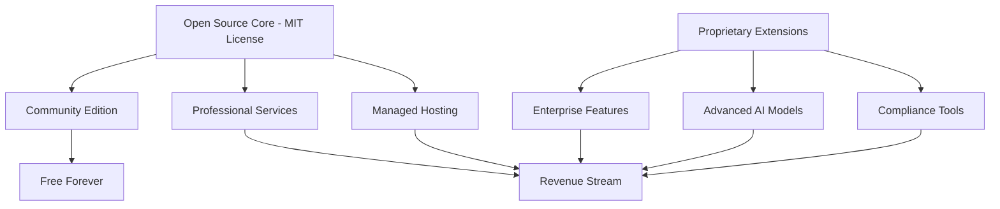

# Open Source & Business Strategy Guide

## 🎯 Executive Summary

Lumora is currently **100% open source** under the MIT License, allowing anyone to use, modify, and commercialize the code. This document outlines the strategic approach for maintaining open source benefits while building a sustainable business model.

## 🔓 Current Open Source Status

### MIT License Benefits
- ✅ **Complete Freedom**: Use, modify, distribute without restrictions
- ✅ **Commercial Use**: Build commercial products based on Lumora
- ✅ **No Attribution Required**: Beyond standard license notice
- ✅ **Community Contributions**: Others can improve and extend the platform

### What's Publicly Available
```
📁 Complete Source Code
├── 🎨 Frontend (Next.js, React, TypeScript)
├── ⚙️ Backend (Express.js, Node.js)
├── 🔒 Security implementations
├── 🤖 AI integration patterns
├── 📚 Documentation and guides
├── 🧪 Testing frameworks
└── 🚀 Deployment configurations
```

## 🏢 For Developers & Companies

### What You Can Do Right Now
1. **Fork & Customize**: Create your own health AI platform
2. **Commercial Use**: Build and sell products based on Lumora
3. **Enterprise Deployment**: Deploy in your organization
4. **Integration**: Connect with existing healthcare systems
5. **Contribution**: Improve the platform for everyone

### Success Stories You Can Follow
- **Self-hosted Solutions**: Deploy for your clinic/hospital
- **White-label Products**: Rebrand for your customers
- **Specialized Versions**: Focus on specific medical areas
- **Integration Services**: Connect with EHR systems

## 💰 Future Business Model Strategy

### The "Open Core" Approach



### Revenue Streams Without Compromising Open Source

#### 1. **Managed Cloud Service** 💰
- Host and manage Lumora instances for customers
- Automatic updates, scaling, and maintenance
- Professional support and SLA guarantees
- **Example**: Like WordPress.com vs WordPress.org

#### 2. **Professional Services** 💰
- Custom implementation and integration
- Healthcare compliance consulting
- AI model customization and training
- **Example**: Like Red Hat's services for Linux

#### 3. **Enterprise Add-ons** 💰
- Advanced AI models (GPT-4, Claude, custom models)
- EHR/FHIR integrations
- Advanced analytics and reporting
- **Example**: Like GitLab's enterprise features

#### 4. **White-label Solutions** 💰
- Custom branding and theming
- Dedicated infrastructure
- Priority support and training
- **Example**: Like Mattermost's enterprise offering

## 🛡️ Protecting Your Investment

### What Open Source Actually Protects

#### ✅ **Advantages**
- **Community Growth**: Others contribute improvements back
- **Trust Factor**: Healthcare users trust transparent code
- **Faster Development**: Community finds and fixes bugs
- **Market Validation**: Proves concept before major investment
- **Talent Attraction**: Developers prefer working on open projects

#### ⚠️ **Common Concerns Addressed**

**"People will steal my idea"**
- Ideas aren't legally protectable anyway
- Execution and brand matter more than code
- First-mover advantage is significant

**"Competitors will copy my code"**
- They'll also contribute improvements back
- You maintain brand and community leadership
- Network effects protect market position

**"I can't make money from open source"**
- Red Hat: $3.4B revenue (open source)
- MongoDB: $845M revenue (open core)
- GitLab: $152M revenue (open core)

### Strategic Protection Methods

#### 1. **Trademark & Brand Protection** 🏷️
```
Register Trademarks:
• "Lumora" name and logo
• Distinctive visual identity
• Marketing slogans and taglines

Benefits:
• Prevent competitors from using your brand
• Control commercial use of name
• Build brand recognition and trust
```

#### 2. **Proprietary Data & Algorithms** 🧠
```
Keep Private:
• Advanced AI prompt engineering
• Proprietary health knowledge databases
• Custom diagnostic algorithms
• Unique user experience innovations

Open Source:
• Basic chat interface
• Standard security implementations
• General AI integration patterns
```

#### 3. **Network Effects & Community** 🌐
```
Build Advantages:
• Large user community
• Ecosystem of integrations
• Healthcare provider partnerships
• Data advantages through scale
```

## 📈 Recommended Business Timeline

### Phase 1: Community Building (Months 1-6)
- **Focus**: Grow user base and contributors
- **Revenue**: $0 (investment phase)
- **Goals**: 
  - 1,000+ GitHub stars
  - 100+ community contributors
  - 10,000+ monthly active users

### Phase 2: Service Launch (Months 6-12)
- **Focus**: Launch managed hosting service
- **Revenue**: $10K-50K MRR
- **Goals**:
  - Professional support plans
  - Managed cloud hosting
  - Enterprise consultation services

### Phase 3: Enterprise Features (Months 12-24)
- **Focus**: Build proprietary enterprise add-ons
- **Revenue**: $100K-500K MRR
- **Goals**:
  - EHR integrations
  - Compliance automation
  - White-label solutions

### Phase 4: Scale & Expansion (Months 24+)
- **Focus**: Market leadership and expansion
- **Revenue**: $1M+ MRR
- **Goals**:
  - Healthcare partnerships
  - International expansion
  - Advanced AI capabilities

## 🎯 What Stays Open vs. Closed

### Always Open Source (MIT License)
```typescript
// Core platform components
export const openSourceComponents = {
  chatInterface: "Complete UI/UX components",
  aiIntegration: "Basic AI model connections",
  security: "CSRF, rate limiting, sanitization",
  documentation: "Guides, tutorials, best practices",
  deployment: "Docker, cloud deployment configs"
};
```

### Future Commercial Extensions
```typescript
// Proprietary business features
export const commercialFeatures = {
  advancedAI: "Custom models, fine-tuning",
  ehrIntegration: "FHIR, HL7 connectors",
  analytics: "Advanced reporting, insights",
  compliance: "HIPAA automation, audit tools",
  whiteLabel: "Custom branding, theming"
};
```

## 🏆 Success Examples to Follow

### MongoDB Strategy
- **Open Source**: Core database engine
- **Commercial**: Atlas cloud service, enterprise features
- **Result**: $845M annual revenue

### GitLab Strategy  
- **Open Source**: Community edition with core features
- **Commercial**: Enterprise features, premium support
- **Result**: $152M annual revenue, successful IPO

### Elastic Strategy
- **Open Source**: Search engine core
- **Commercial**: Cloud service, enterprise security
- **Result**: $608M annual revenue

## 💡 Key Strategic Insights

### Open Source is a Growth Strategy
1. **Faster User Acquisition**: No barriers to trying the product
2. **Community-Driven Development**: Others help build and improve
3. **Trust in Healthcare**: Transparency builds user confidence
4. **Talent Magnet**: Attracts top developers to your team

### Your Competitive Moats
1. **Brand Recognition**: First and best-known open source health AI
2. **Community Leadership**: Largest contributor and user base
3. **Domain Expertise**: Deep healthcare knowledge and experience
4. **Execution Quality**: Superior user experience and reliability
5. **Speed of Innovation**: Fastest to market with new features

### The Real Value Isn't in Hiding Code
The value is in:
- **Superior execution** and user experience
- **Strong brand** and community trust
- **Proprietary data** and insights from usage
- **Professional services** and expert support
- **Continuous innovation** and feature development

## 🚀 Getting Started

### For Individual Developers
1. Fork the repository
2. Set up local development environment
3. Read the contributing guidelines
4. Start with small improvements or bug fixes
5. Join the community discussions

### For Companies
1. Evaluate Lumora for your use case
2. Deploy a test instance
3. Assess integration requirements
4. Consider contributing improvements back
5. Contact for professional services if needed

### For Healthcare Organizations
1. Review security and compliance documentation
2. Test with non-production data first
3. Evaluate against your specific requirements
4. Consider managed hosting for production use
5. Plan for staff training and adoption

## 📞 Next Steps

**Ready to build with Lumora?**
- 📖 Read the [Contributing Guide](./CONTRIBUTING.md)
- 🏗️ Check the [Architecture Documentation](./ARCHITECTURE.md)
- 🔒 Review [Security Policies](./SECURITY.md)
- 💬 Join our community discussions
- 📧 Contact for business inquiries

---

**Remember**: Open source is not about giving away value—it's about creating more value for everyone while building a sustainable business around superior execution, brand, and services.